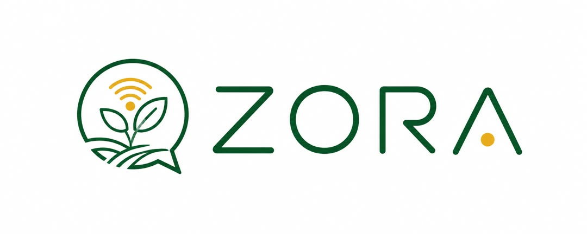
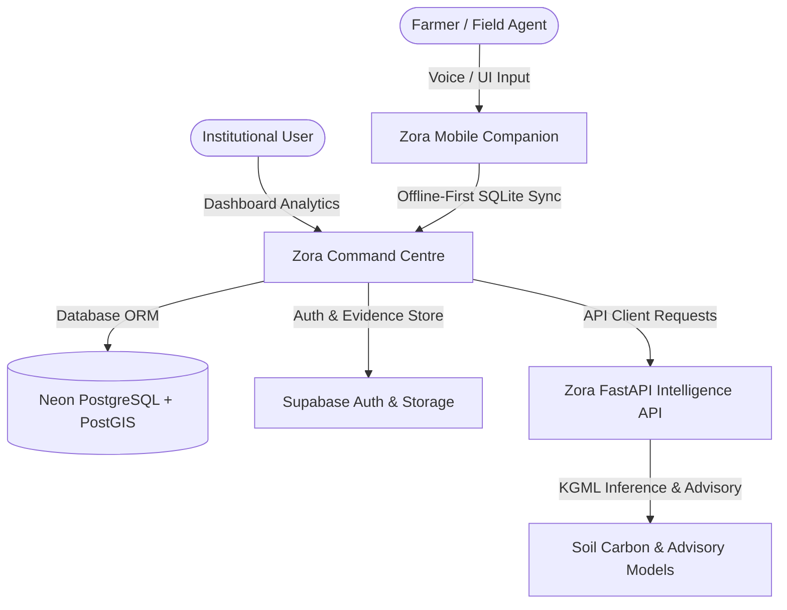

# CCSA Zora - Comprehensive Platform Guide & Documentation



**CCSA Zora** is an agricultural super-intelligence platform developed by the **Centre for Climate-Smart Agriculture (CCSA)** at **Cosmopolitan University, Abuja**. Serving as a voice-first, multilingual digital extension officer, Zora empowers smallholder farmers, agronomists, researchers, verifiers, and climate-smart agricultural institutions.

By integrating conversational AI with spatial mapping, local sensor telemetry, and cryptographic verification, Zora bridges the gap between field-level activities and global climate finance (MRV - Measurement, Reporting, and Verification).

---

## 1. Product Vision & Surfaces

CCSA Zora extends the **Farmers Information Management System (FIMS)** into a modern, trusted agricultural framework. The platform consists of four core surfaces:



### 1.1 Zora Intelligence Command Centre (`apps/web`)

A high-density dashboard built using **Next.js 16.2** and **Tailwind CSS 4**. Designed for institutional operators, agronomists, and verifiers to monitor:

- Geospatial field boundary maps and vegetation health indices (NDVI).
- Live LPWAN telemetry nodes.
- Verifier-attested practice evidence and compliance status.
- Unified agricultural intelligence through custom chart visualizations.

### 1.2 Zora Companion Mobile App (`apps/mobile`)

An offline-first mobile client powered by **Expo (React Native v57.0)**. It supports extension agents in rural areas lacking cellular connections:

- **Offline Data Logging**: Saves observations, boundary plots, and photo evidence to a local Expo SQLite database.
- **Voice-First Interface**: Audio recording and text-to-speech services tailored for local African languages.
- **Secure MFA Authentication**: Enhances identity checks using Supabase Multi-Factor Authentication (MFA) via TOTP.

### 1.3 Zora Intelligence API (`apps/kgml-api`)

A Python **FastAPI** service encapsulating versioned agricultural model inferences and advisory engines:

- **KGML-Ag (Knowledge-Grounded Machine Learning)**: Combines soil science rules with statistical models to output soil organic carbon (SOC) metrics.
- **Advisory Service**: Generates structured, multilingual advisory content matching the severity of crop, soil, and climate risks.

### 1.4 Zora Trust Fabric (`packages/db`)

The underlying data and security layer using **Drizzle ORM** on a **PostgreSQL + PostGIS** database. It secures the platform via:

- **Row-Level Security (RLS)**: Scopes data access strictly to authenticated FIMS tenant organizations.
- **Cryptographic Audit Trails**: Ensures that changes to carbon certificates and MRV evidence form an append-only, tamper-evident hash chain.

---

## 2. Capability & Feature Matrix

| Capability                  | Technical Implementation                                                                                                                                          |
| :-------------------------- | :---------------------------------------------------------------------------------------------------------------------------------------------------------------- |
| **Multilingual Advisory**   | Localized agronomic feedback provided in **English (en)**, **Hausa (ha)**, **Yorùbá (yo)**, **Igbo (ig)**, and **Fulfulde (ff)**.                                 |
| **Voice Intelligence**      | Voice capturing via browser speech recognition API and native `expo-audio` recorders. Speech synthesis via Web SpeechSynthesis and native `expo-speech` playback. |
| **Evidence Cryptography**   | On-device computation of SHA-256 hashes of photos captured with `expo-camera`. Ensures untampered files are sent to Supabase storage.                             |
| **Geospatial Mapping**      | Real-time plotting using PostGIS `MultiPolygon` and `Point` coordinate systems. Visualized using MapLibre (web) and Expo Maps (mobile).                           |
| **Offline Synchronization** | Idempotent SQLite outbox syncing using pull/push cursors, retry schedules, and manual conflict resolution interfaces.                                             |
| **KGML-Ag Reasoning**       | Provides clear reference inputs, soil carbon inferences, and audit traces that cite scientific databases or local guidelines.                                     |
| **Signed IoT Ingestion**    | HMAC-signed telemetry ingestion from LPWAN (LoRaWAN / NB-IoT) sensors deployed directly on fields.                                                                |
| **Institutional Analytics** | Command centre summaries displaying vegetation vitality charts (Recharts), climate heat risk, and verifier checkmarks.                                            |

---

## 3. Impact Use Cases

```
                                  [ Zora Platform ]
                                   /      |      \
                                  /       |       \
                                 /        |        \
            [Smallholder Farmer]    [Field Agent]    [Carbon Verifier]
            - Multilingual Advice   - Offline GPS    - Cryptographic Auditing
            - Voice & Audio Aids    - Photo Hashing  - Evidence Chain Verification
```

### 3.1 Smallholder Farmers: Multilingual Voice Advisory

Farmers in rural areas can ask questions in their native dialect (e.g., Hausa, Yorùbá) regarding crop distress, soil moisture, or weather patterns. Zora responds with synthesized speech, bypassing literacy barriers and giving actionable tips in real-time.

### 3.2 Field Agents: Offline Evidence Logging

Extension workers operating in remote regions map farm boundaries, log fertilizer practices, and capture photo evidence using their mobile devices without active internet access. Data is saved securely in a local database and synced automatically when network coverage becomes available.

### 3.3 Carbon Verifiers: Tamper-Proof MRV Checking

Verifier portals audit the timeline of a field's agricultural events. By checking the immutable database log, the verifier validates that the on-site sensor telemetry, satellite NDVI indicators, and field-photo hashes match perfectly before approving carbon credit certificates.

---

## 4. Repository Structure & Packages

- **`apps/`**
  - [web/](file:///c:/projects/ccsa-aiv2/apps/web): Next.js agricultural dashboard and brand resources.
  - [mobile/](file:///c:/projects/ccsa-aiv2/apps/mobile): Expo React Native offline-first companion application.
  - [kgml-api/](file:///c:/projects/ccsa-aiv2/apps/kgml-api): FastAPI Python server running ML inferences and advisories.
- **`packages/`**
  - [db/](file:///c:/projects/ccsa-aiv2/packages/db): Drizzle database schema, SQL security hooks, and PostGIS helper scripts.
  - [api-client/](file:///c:/projects/ccsa-aiv2/packages/api-client): Isomorphic HTTP client for communicating with Zora APIs.
  - [ui/](file:///c:/projects/ccsa-aiv2/packages/ui): Reusable shadcn/ui React components.
  - [utils/](file:///c:/projects/ccsa-aiv2/packages/utils): Shared types, GeoJSON structures, and sync protocols.
- **`scripts/`**
  - [scaffold.ps1](file:///c:/projects/ccsa-aiv2/scripts/scaffold.ps1): Automates workspace setup and code scaffolding.

---

## 5. Installation & Setup Guide

### 5.1 System Prerequisites

Make sure your development machine has the following tools installed:

- **Node.js**: `v22.13.0` or newer
- **pnpm**: `v10.11.1`
- **Python**: `v3.12` or newer
- **uv**: Python package installer ([Install Guide](https://docs.astral.sh/uv/getting-started/installation/))
- **Git**

---

### 5.2 Step-by-Step Local Setup

#### Step 1: Clone the Repository & Configure Environments

Duplicate the environment variable templates for the web and mobile applications:

```powershell
Copy-Item apps/web/.env.example apps/web/.env.local
Copy-Item apps/mobile/.env.example apps/mobile/.env.local
```

#### Step 2: Install Node Dependencies

Run the installation command from the monorepo root to lock dependencies across all workspaces:

```powershell
pnpm install --frozen-lockfile
```

#### Step 3: Set Up Python API Environment

Use `uv` to configure the Python virtual environment and install dependency packages for the FastAPI server:

```powershell
uv --directory apps/kgml-api sync --dev --frozen
```

#### Step 4: Run Static Checks

Validate TypeScript configurations and ensure there are no build anomalies:

```powershell
pnpm typecheck
```

---

### 5.3 Database Configuration & Deployment

Production deployments utilize a **PostgreSQL** instance with **PostGIS** extensions enabled (e.g. Neon PostgreSQL).

1.  **Configure environment variables**: Update the `DATABASE_URL` in `apps/web/.env.local` to point to your PostgreSQL string.
2.  **Deploy Schema**: Run the migration pipeline commands in order:
    ```powershell
    pnpm db:prepare         # Enables PostGIS & cryptographic extensions
    pnpm db:migrate         # Applies the Drizzle database schemas
    pnpm db:harden          # Adds immutable record protection triggers
    pnpm db:security        # Configures Supabase RLS security policies
    pnpm db:api             # Deploys API support functions
    pnpm db:seed:demo       # Seeds demo dataset (optional)
    ```

---

### 5.4 Running the Services Locally

Use separate terminals to start the development servers:

#### Start the Python API Server (KGML-API):

```powershell
pnpm dev:api
# Access endpoint details at http://127.0.0.1:8000/docs (Swagger UI)
```

#### Start the Next.js Command Centre:

```powershell
pnpm dev:web
# Open the web application at http://localhost:3000
```

#### Start the Expo Mobile Companion:

```powershell
pnpm dev:mobile
# Open Expo Go or test on an emulator.
# (Optional) Update EXPO_PUBLIC_API_URL in `.env.local` with your computer's LAN IP.
```

---

## 6. Cryptographic Auditing & MRV Lifecycle

The CCSA Zora platform features cryptographic audit logs to support carbon credit verification. Overwriting historical certificate data is strictly prevented. Modifications generate new events in a chronological sequence:

```
[Carbon Certificate] ───> [Event 1: ISSUED] (Hash A)
                                ▲
                                │ (previousEventHash: Hash A)
                          [Event 2: RETIRED] (Hash B)
```

### Hash-Chained Events (`carbon_certificate_events`)

Every status modification computes an `event_hash` based on:

1.  The sequence number of the event.
2.  The UUID of the target certificate.
3.  The SHA-256 payload representation.
4.  The cryptographic hash of the immediately preceding event (`previous_event_hash`).

This chain makes tampering with certificate histories immediately obvious to verifiers.

---

## 7. Troubleshooting

### 7.1 "Fatal: Not a Git Repository"

If Git commands fail with an empty folder error, re-initialize the repository:

```powershell
git init
git add .
git commit -m "Initial commit of CCSA Zora Platform"
```

### 7.2 PostGIS Missing SRID Errors

If spatial queries return PostGIS validation errors, verify that database coordinates use SRID **4326** (WGS 84):

```sql
SELECT ST_SRID(boundary) FROM fields; -- Should return 4326
```

---

_For operations guides, deployment checklists, and product concept blueprints, refer to the files in the [`docs/`](file:///c:/projects/ccsa-aiv2/docs) folder._

---

**Abdulrahman Dauda Gaya**  
CTO - CCSA  
Cosmopolitan University Abuja

