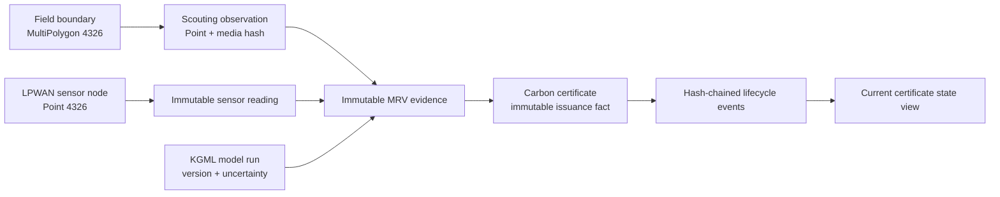

# CCSA Zora project initiation

## Reproduce this checkout

From the repository root, the supported setup path is:

```powershell
$ErrorActionPreference = "Stop"

Copy-Item .env.example .env.local -ErrorAction SilentlyContinue
corepack enable
corepack prepare pnpm@10.11.1 --activate
pnpm install
uv --directory apps/kgml-api sync --dev --frozen

# Expo resolves native packages against SDK 57.
pnpm --filter @ccsa-zora/mobile exec expo install --check

pnpm validate:structure
pnpm typecheck
pnpm test:api
pnpm --filter @ccsa-zora/mobile exec expo export --platform android --output-dir dist-android
pnpm --filter @ccsa-zora/mobile exec expo export --platform ios --output-dir dist-ios
pnpm --filter @ccsa-zora/web build
```

The equivalent helper is:

```powershell
.\scripts\scaffold.ps1
```

## Greenfield scaffold commands

These commands show the generators and dependency groups used to create the
foundation. Run them only in a new empty directory; the checked-in repository
already contains the customized result.

```powershell
$ErrorActionPreference = "Stop"

New-Item -ItemType Directory -Path ccsa-zora-platform
Set-Location ccsa-zora-platform

corepack enable
corepack prepare pnpm@10.11.1 --activate

# Creates apps/web, packages/ui, components.json files, and Turborepo.
pnpm dlx shadcn@latest init --monorepo
# Choose the Next.js template when prompted.

# Expo SDK 57, Router, and TypeScript.
pnpm dlx create-expo-app@latest apps/mobile `
  --template default@sdk-57 `
  --no-install `
  --no-agents-md

New-Item -ItemType Directory -Force packages/utils/src
New-Item -ItemType Directory -Force packages/db/src/schema
New-Item -ItemType Directory -Force apps/kgml-api/app

# Web state, GIS, and high-density geospatial rendering.
pnpm --filter ./apps/web add `
  @tanstack/react-query zustand maplibre-gl `
  @deck.gl/core @deck.gl/layers

# Shared database package.
pnpm --filter ./packages/db add `
  drizzle-orm postgres @ccsa-zora/utils@workspace:*
pnpm --filter ./packages/db add -D drizzle-kit @types/node

# Mobile state and shared contracts.
pnpm --filter ./apps/mobile add `
  @tanstack/react-query zustand `
  @ccsa-zora/utils@workspace:*

pnpm install

# Native modules must be resolved by Expo against the selected SDK.
pnpm --filter ./apps/mobile exec expo install `
  expo-router expo-sqlite expo-camera expo-location expo-crypto `
  expo-audio expo-speech `
  react-native-maps react-native-safe-area-context react-native-screens
```

After the generators finish, replace their generic theme with the tokens in
`packages/ui/src/styles/globals.css`, add the Drizzle schema, and add the mobile
feature module described below.

## Field scouting module

```text
apps/mobile/
├── app/
│   ├── assistant.tsx
│   └── scouting/
│       └── new.tsx
└── src/features/field-scouting/
    ├── components/
    │   └── field-boundary-map.tsx
    ├── data/
    │   ├── migrations.ts
    │   └── scouting.repository.ts
    ├── state/
    │   ├── scouting-store.ts
    │   └── sync-store.ts
    └── sync/
        ├── http-transport.ts
        ├── sync-coordinator.tsx
        └── sync-engine.ts
```

The repository and outbox write in one SQLite transaction. Sync uses client
UUIDs, stable idempotency keys, retry backoff, and server versions. A photo is
hashed before upload and can be retried independently of its observation.
Verified MRV evidence is never overwritten during conflict resolution.
Cross-platform validation, API, GeoJSON, and sync contracts live in
`packages/utils` and `packages/api-client`.

## Core data flow



## Production gates

1. Apply Neon row-level security and use the restricted `zora_app` role before
   exposing any table through the trusted API.
2. Make certificate issuance, model inference, and verifier attestation
   trusted-service operations.
3. Store object hashes before adding evidence to the chain; never rely on a
   storage URL alone.
4. Partition `sensor_readings` by time when ingestion volume justifies it.
5. Add a vector-tile service for large field portfolios instead of returning
   raw GeoJSON collections.
