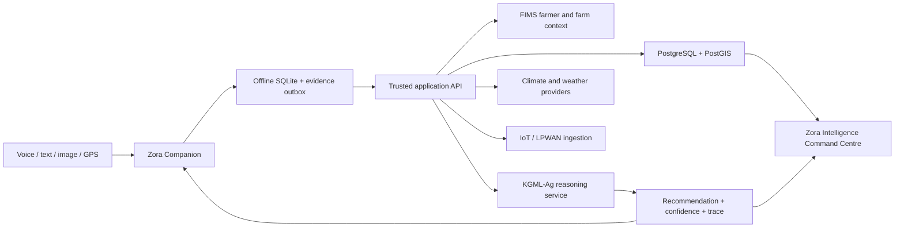

# CCSA Zora product blueprint

## Product promise

Zora is a trusted agricultural companion that makes expert, climate-smart
knowledge accessible regardless of a farmer's language, literacy, connectivity,
or location. It amplifies extension officers and researchers; it does not hide
uncertainty or replace accountable human expertise.

## Experience principles

1. **Voice before forms** - the primary farmer interaction is a natural
   conversation, with text and structured records as supporting interfaces.
2. **Show, locate, remember** - image evidence, GPS context, farm history, and
   current climate conditions travel with each question.
3. **Offline is a normal state** - local work must remain safe and useful with
   intermittent connectivity.
4. **Reasoning is inspectable** - recommendations expose confidence, knowledge
   basis, model version, follow-up actions, and evidence provenance.
5. **Agricultural, not generic AI** - Zora uses field-green, leaf, sun, soil,
   and high-contrast information design rather than blue/purple AI tropes.
6. **One platform, different altitudes** - farmers receive simple next actions;
   institutions receive portfolio, evidence, geospatial, and impact detail.

## Users

- **Farmers:** voice guidance, crop/livestock triage, weather actions, records,
  mapping, and offline continuity.
- **Extension officers:** farmer caseloads, visit planning, AI-assisted triage,
  evidence review, and escalation.
- **Researchers:** governed real-time datasets, knowledge curation, model
  evaluation, and spatial analysis.
- **Government and partners:** coverage, food-security, resilience, adoption,
  and impact intelligence.
- **Financial institutions:** permissioned farmer/farm profiles, risk signals,
  and verified practice evidence.

## Intelligence architecture

## Knowledge domains

KGML-Ag connects crops, growth stages, diseases, pests, soils, climate,
fertilizers, livestock, CCSA research, extension guidance, indigenous knowledge,
and field evidence. Every production knowledge item should carry provenance,
geographic applicability, language coverage, review status, and effective dates.

## Delivery phases

### Phase 1 - trusted companion

- Multilingual conversation and speech output.
- Voice capture and provider-ready transcription boundary.
- Crop/livestock image evidence and diagnosis contract.
- FIMS organization, farmer, farm, and field context.
- KGML-Ag reference advisory with confidence and knowledge basis.

### Phase 2 - field intelligence

- Weather-provider integration and alert subscriptions.
- Farm boundary mapping, problem hotspots, visit tracking, and spatial analytics.
- Offline field packs, outbox sync, conflicts, and media integrity.
- Extension workflow, surveys, livestock guidance, and portfolio analytics.

### Phase 3 - predictive agriculture

- Drone and satellite imagery pipelines.
- Production LPWAN sensor fleets and anomaly detection.
- Validated computer-vision and predictive crop models.
- Governed autonomous agents with human approval, budgets, audit logs, and
  explicit safety constraints.

## Production integration boundaries

The repository implements stable UI, API, data, offline, and audit contracts.
Production deployment still requires institution-selected providers and
credentials for speech-to-text, foundation models, computer vision, local
weather, satellite/drone imagery, FIMS identity/data exchange, Supabase Auth and
Storage, Neon, and EAS signing. Those adapters must preserve Zora's evidence,
uncertainty, tenant, and human-approval boundaries.
